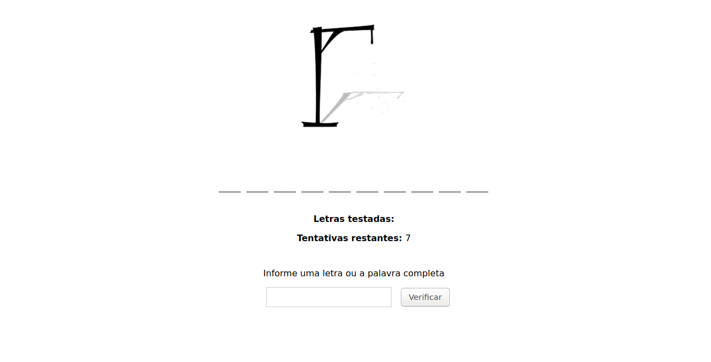
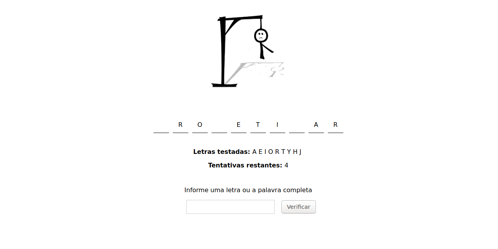

# hangman-game

## About the project
This repository contains a hangman game developed with `Vanilla javascript`, `html5` and `css3`.

The game will choose a random word and you need guess informing a letter or the complete word. If the system to recognize that you hit the letter, it'll fill the field to you and when all fields are filled, you win. However, if you make a mistake, the doll will be filled until it is completed. When is happens, you loss the game.

## Technologies
- Javascript
- HTML5
- CSS3

## How to run?
- Clone the repository
- Open the index.html file in your browser